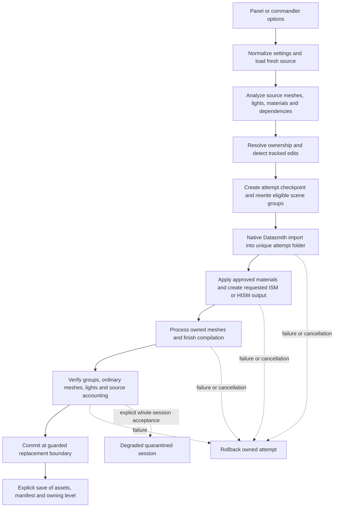

# Current architecture

Source-checked 2026-09-27 after preset/cancellation fixes; the [current tested snapshot](Validation/2026-09-27-preset-cancellation-evidence.json) contains 55 source files. See the [contract](../IMPORT_PANEL_VALIDATION.md) for guarantees and [ADRs](ADR/README.md) for decision rationale.

## Module boundaries

| Module | Type and responsibilities |
|---|---|
| `DatasmithHISM` | Editor: source translation, planning, import, material review, mesh/light processing, verification, ownership, replacement, rollback, persistence, Slate, commandlet, and legacy tools |
| `DatasmithHISMRuntime` | Runtime: source records, Blueprint lookup, Development-only opt-in validation command; depends on Core, CoreUObject, Engine |

The editor module depends on the runtime module. Runtime does not depend on DatasmithImporter, UnrealEd, Slate, or the editor manifest. The manifest and ownership marker identify themselves as editor-only for cooking. Imported geometry, material/texture references, lights, and source records are retained as normal runtime content.

## Tracked import sequence

The previous active version remains the recovery copy while the replacement is built and checked. Supersede removes prior world actors only through the centralized lifecycle path. Old asset packages remain retained. A verified result in memory is not proof of a successful disk save.

Analyze uses the same source loading/planning rules without creating scene assets or actors. It also compares recorded source inventories and tracked output when available. A report may be written to `Saved`; read-only analysis refers to the source and scene, not an absence of diagnostic files.

## Source map

All editor source paths below are relative to [Source/DatasmithHISM](../Source/DatasmithHISM).

| File | Responsibility |
|---|---|
| [Import service](../Source/DatasmithHISM/Private/ConVerseDatasmithImportService.cpp) | Plans, scene rewrite, source accounting, ownership, verification orchestration, commit, supersede, rollback, reports |
| [Progress helper](../Source/DatasmithHISM/Private/ConVerseImportProgress.h) | Operation-local cancellation latch, named work notifications and streamed pre-mutation fingerprints |
| [Processing helper](../Source/DatasmithHISM/Private/ConVerseImportProcessing.cpp) | Appearance evidence, mappings, dependency inventory, mesh/light processing, tracked-state capture/comparison |
| [Persistence helper](../Source/DatasmithHISM/Private/ConVerseImportPersistence.cpp) | JSON presets, explicit save, guarded initial save-as rebinding and refusal diagnostics, attempt journals and recorded recovery paths |
| [Panel](../Source/DatasmithHISM/Private/ConVerseDatasmithImportPanel.cpp) | Slate controls, status, previews, conflict decision, source inspection |
| [Material review](../Source/DatasmithHISM/Private/ConVerseMaterialReview.cpp) | Linked table creation, candidate evidence, approval/revocation, native source/target asset editors |
| [Commandlet](../Source/DatasmithHISM/Private/ConVerseOptimizedImportCommandlet.cpp) | Headless dispatch, map/save switches, refusal of already-saved map copies before import, geometry evidence export |
| [Manifest](../Source/DatasmithHISM/Public/ConVerseOptimizedImportManifest.h) | Schema, owned packages/actors, group/source records, settings, verification and tracked baseline |
| [Processing/table types](../Source/DatasmithHISM/Public/ConVerseImportRecipe.h) | Nanite policies, exceptions, material row schemas, inspection/review records |
| [Reimport guard](../Source/DatasmithHISM/Private/ConVerseOptimizedReimportHandler.cpp) | Priority-based refusal of stock reimport for actively marked owned assets |
| [Runtime metadata](../Source/DatasmithHISMRuntime/Public/ConVerseSourceMetadata.h) | Cookable source records and lookup by component/instance |

## Identity and grouping

Optimized groups use exact Datasmith mesh element identity and compatible source settings under the same immediate parent. Unsupported candidates stay ordinary; parent-bearing and mirrored actors are not discarded to improve group counts. Source element names join records; sanitized display labels are not identity.

PlanId incorporates contract version, primary source content, normalized output settings, exact mesh exceptions, and approved mapping identity. Sidecar fingerprints are stored separately and warn without triggering replacement. Catalog-only edits and light-warning thresholds are advisory. Every new setting that changes generated output must be reviewed for plan identity.

New manifest schema: **2**. Tracked-state baseline and source-comparison inventory each have version **1**. Older fields remain unknown rather than implicitly verified. Unknown future schemas and ambiguous active ownership block destructive replacement. The stock reimport handler's `UFactory::GetDefaultImportPriority() + 100` registration is covered by real-dispatch automation.

## Transforms and scene components

Initial naming of an unsaved world may rebind paths only when the old world is unresolved and actor GUIDs, paths and session ownership match. Native Save As of an already-saved map duplicates actor identity instead. The commandlet refuses that copy before import, and the explicit-save service refuses an unproven native copy with recovery instructions. No path or copied tag alone transfers ownership.

Bare scene components carry transforms and attachment relationships but do not render meshes. Preserving these roots keeps nested/link placement and attached lights meaningful. The legacy converter accepts appropriate native transform scaffolding while rejecting behavior-bearing actor payload. Its component placement now uses the mesh component's world transform, including offsets below an actor root.

Legacy grouping and deduplication use different eligibility/equivalence logic from tracked import. They have no session ownership or rollback contract. Do not call the legacy tools to modify an active tracked session as a substitute for rebuilding it.

## State, diagnostics, and limitations

Tracked comparison records actors, scene components, meshes, and imported materials. Canonical material state ignores generated expression GUIDs only; actual parameter changes remain observable. It is a defined tracked baseline, not a claim to detect every possible Unreal edit or external material revision.

Progress stages and summary reporting are shared by service/panel/commandlet. Uninterruptible translator and mesh compilation work returns before cancellation is finalized. Attempt journals list known object paths where available; discovering an interrupted attempt does not authorize automatic deletion.

Three persistence regression tests are in [ConVersePersistenceAutomation.cpp](../Source/DatasmithHISM/Private/Tests/ConVersePersistenceAutomation.cpp). The same file supplies explicitly invoked interruption/probe tests outside the normal 30-test suite. [Invoke-InterruptedRecovery.ps1](../Tests/Invoke-InterruptedRecovery.ps1) launches its own disposable process, terminates it at the recorded checkpoint, and verifies fresh-process diagnostics and unchanged files. This covers one recovery scenario, not transactional resume.

Process peak memory is a lifetime high-water mark. Mesh processing time includes policy changes and builds; compilation wait is reported separately. Neither substitutes for a representative CPU/GPU camera-path benchmark. See [validation](VALIDATION.md).
