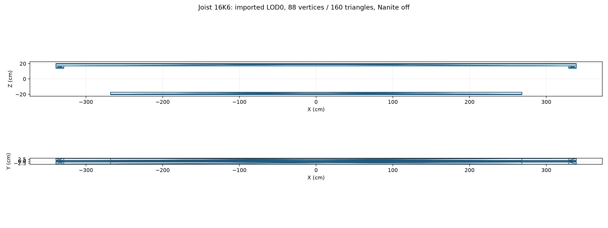

# Roadmap implementation evidence, 2026-09-26

Release acceptance is incomplete. This record separates observed evidence from remaining gates. Machine-readable test results are in [the evidence file](2026-09-26-evidence.json).

The later [Phase 2 follow-up](2026-09-26-phase2.md) supersedes this record's persistence/recovery backlog and 24-test count with new evidence and 27 passing tests. Package, source-data and rendered limitations recorded here remain applicable.

## Structural finding

The original structural export identifies Revit 2027 and Datasmith SDK 5.6.1. Mesh `944b1f630c7e6f634621bcd04007fdf3`, labelled `Structural_Framing_K-Series_Bar_Joist-Angle_Web_16K6`, is used by Revit elements 610662 and 610663.

Direct deserialization of its `.udsmesh` payload reports **88 vertices and 160 triangles**. The triangle-edge plot contains upper/lower chords and end details, with no diagonal web members. The raw payload and all six independently imported ordinary/ISM/HISM and Nanite-preserve/all combinations produce the same exported LOD0 OBJ SHA-256:

`fd92149136fce0483709bea955efd31eafc84af191c55ef16b4f718601669c72`

This image plots mesh coordinates; it is not an Unreal viewport render. The ordinary comparison uses the native Datasmith factory through the tracked importer with no grouping. A separate stock-toolbar import and rendered comparison remain outstanding.

**Finding:** this fixture's webbing is already absent from the exported payload, before importer conversion or Nanite. The source mesh MD5 is `09a89ee1bcb2b412de6f84d671be8f42`; the structural primary-file MD5 is `b39cb401399641a9b8d8a5adf6933d65`.

Inspect the original family's geometric representation, view/family visibility, detail settings, and export. The particular Revit setting responsible has not been demonstrated. Epic documents that exported geometry follows the active 3D view's visible geometric objects and that Revit supplies tessellation. A corrected export must actually contain the diagonals before this fidelity gate can pass. [Epic: using Datasmith with Revit](https://dev.epicgames.com/documentation/unreal-engine/using-datasmith-with-revit-in-unreal-engine)

## Source-data blockers

- Structural preflight finds eight missing texture references covering seven filenames: `autodesk.png`, `Revit.png` (two references), `Historic3.png`, `Brownsville.png`, `Historic1.png`, `Fayette.png`, and `Historic2.png`.
- HVAC preflight finds the missing `metals.ornamental metals.plate.mesh.1.bump.jpg`.
- The HVAC export identifies Revit 2025 / Datasmith SDK 5.3.0-24761556 and contains **1,033 PointLight elements, all declaring Unitless intensity**. This differs from the structural export's versions; the version difference is recorded, not asserted to cause the geometry defect.
- The extracted HVAC light imports and verifies its intensity 100, Unitless units, and IES state. Original Revit initial intensity, light-loss factors, and reference rendering remain needed to establish photometric agreement. Revit photometric controls distinguish initial intensity and related light-source properties. [Autodesk: lighting-fixture parameters](https://help.autodesk.com/cloudhelp/2026/ENU/Revit-DocumentPresent/files/GUID-D78A352A-4143-4D3E-8B0D-BB0991C6E0AF.htm)

Both full-scene import attempts stop before mutation on their dependency errors. Full structural/HVAC alignment and rendered acceptance are therefore not established by these runs.

## Build, automation, and persistence

- UE 5.8.3 `AdvancedHISMEditor Win64 Development`: passed. Log: `Saved/Logs/RoadmapBuild.txt`.
- Full `Automation RunTests DatasmithHISM`: **24/24 passed**, zero `LogAutomationController: Error:` entries, test exit code 0. Log: `Saved/Logs/RoadmapAutomation.txt`.
- Six independent joist import combinations: verified; source/imported LOD0 geometry identical. Logs: `Saved/Logs/JoistOrdinary*.txt`, `JoistISM*.txt`, `JoistHISM*.txt`.
- A generated validation map was made read-only before an explicit save. The commandlet returned exit 1 with `Save incomplete`, the map SHA-256 was unchanged, and its original attributes were restored. Log: `Saved/Logs/ReadOnlySaveAcceptance.txt`. Disk-full behavior remains untested.
- Save and reopen in a fresh process: `AlreadyCurrent`, with no new import session. Named-map save and saving an initially unnamed map were exercised.
- Save-as exposed a false-positive material drift: PostLoad populated an expression GUID without changing the parameter value. Comparison now excludes these generated expression identifiers. The regression test also changes the actual value and proves that edit is still detected. Final check: `Saved/Logs/SaveAsReopenFixed.txt`.
- Added-component/transform conflicts, changed material appearances, missing approved targets, ordinary-mesh Nanite, advisory-only plan identity, ambiguous active ownership, rollback, quarantine, and real stock-reimport dispatch are covered by automation.

## Packaged output

The first clean Win64 Development build/cook/stage/archive passed. Its packaged executable passed source lookup and mesh/material reference checks for two joist instances. Logs: `Saved/Logs/RoadmapPackage.txt` and `Saved/Logs/PackagedRuntime.txt`.

The expanded Win64 Development build/cook/stage/archive also passed, with exit code 0. Its packaged executable passed in both NullRHI and DX12 runs: **3 source records, 1 mesh component, 1 light, 1 IES profile, 1 successful collision trace, 0 errors**. Logs: `Saved/Logs/RoadmapPackageFinal.txt`, `Saved/Logs/PackagedRuntimeFinal.txt`, and `Saved/Logs/PackagedRuntimeDX12.txt`. The archive is under `Saved/ConVersePackagedValidationFinal/Windows`. Final editor-only preview/progress refinements were built and tested after this cook; the runtime module was unchanged.

These are packaged smoke tests, including actual DX12 startup; rendered appearance, ordinary texture/UV coverage, live Slate interaction, navigation/LOD stress, and fixed-camera CPU/GPU performance remain separate gates.

## Remaining release work

1. Obtain a corrected joist export and complete structural/HVAC sidecars. Validate full models, known dimensions/elevations, common reference points, nested links, mirrored placement, distant coordinates, and rendered thin geometry.
2. Calibrate known Revit lights, including IES on/off, falloff and exposure. Preserve the current unresolved diagnostic until authoritative values support a conversion.
3. Review Autodesk library identities/versions and stock/custom variants. The catalog infrastructure and observed inventory exist; verified stock coverage and approved replacement coverage have not been established.
4. Exercise live Analyze progress/cancellation, material-review controls, and source selection in the editor. Validate disk-full saves, real process interruption, already-named level rename/save-as, and ownership recovery without automated deletion.
5. Expand cooked/rendered acceptance to ordinary textures, all supported light types, collision/navigation and LOD/culling combinations. Record representative CPU/GPU camera-path baselines and a real mesh-compilation failure.

Source relinking, automatic cleanup, cross-asset deduplication, selective extraction, and the optional Unreal material pack remain deferred as specified in the accepted plan.

## Documentation reconciliation

The subsequent documentation refresh references this executed evidence without rerunning Unreal. Reproduction steps are in [validation](../VALIDATION.md), decisions in [ADRs](../ADR/README.md), and earlier plans in [history](../History/README.md). Build/automation/package results above remain distinct from unresolved release gates.
